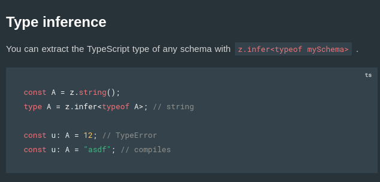

## Pick =>

```ts
interface User {
    id: string;
    name: string;
    age: number;
    email: string;
    password: string;
};

interface UpdateProps {
    name: string;
    age: number;
    password: string;
} // this is good but bad
// we can create a subset of User to re-use the User interface rather than creating a new interface
// To achive this we use PICK!


function updateUser(user: UpdateProps){
    // hit the database to update the user, where u can only chage the name, age, password only
}
```

**Pick =>**
- Pick allows you to create a new type by selecting a set of properties (Keys) from an existing type (Type).
```ts
interface User {
    id: string;
    name: string;
    age: number;
    email: string;
    password: string;
};

type UpdateProps = Pick < User, 'name' | 'age' | 'email' > // Pick

function updateUser(user: UpdateProps){
    // hit the database to update the user, where u can only chage the name, age, password only
}
```

## Partial =>
- In the above `UpdateProps` all the properites or some could be optional. To make it optional we use Partial rather than createing a new interface or type.
- `Partial` makes all properties of a type optional, creating a type with the same properties, but each marked as optional.

```ts
type UpdatePropsPartial = Partial <UpdateProps> // Partial, {name? age? email?}
```

## Readonly =>

```ts
const arr = [1, 4, 5];
arr[0] = 30; // we can update the arr even its it is const... Reason => we can update the value inside arr. We are not changing the reference.
```

```ts
type User = {
    readonly name: string;
    readonly age: number;
}

const user: User = {
    name: "asad",
    age: 20
}

user.name = "newName"; // TS gives error here...
```

```ts
// More easy readonly code =>
type User = {
    name: string;
    age: number;
}

const user: Readonly < User > = {
    name: "asad",
    age: 20
}

user.name = "newName"; // TS gives error here...
```

## Record and Map =>

```ts
type User = {
    id: string;
    username: string;
}

type Users = {
    [key: string] : string;
} // looks ugly

const users = {
    "abc@q1" : {
        id: "abc@q1",
        username: "sahil"
    },
    "abc@q2" : {
        id: "abc@q2",
        username: "sahillllll"
    }
}
```

- Record =>
```ts
type User = {
    id: string;
    username: string;
}

// Record
type Users = Record<string, number>;

const users = {
    "abc@q1" : {
        id: "abc@q1",
        username: "sahil"
    },
    "abc@q2" : {
        id: "abc@q2",
        username: "sahillllll"
    }
}
```

- Map =>
```ts
const users = new Map()

users.set("abc", { name: "abc", age:20 } );
users.set("qwe", { name: "qwer", age:10 } );

const user = users.get("abc");
console.log(user);
```

```ts
// Better code with type `User`
type User = {
    name: string;
    age: number;
}
const users = new Map<string, User>()

users.set("abc", { name: "abc", age:20 } );
users.set("qwe", { name: "qwer", age:10 } );

const user = users.get("abc");
console.log(user);
```

## Exclude =>
```ts
type EventType = 'click' | 'scroll' | 'mousemove';
type ExcludeEvent = Exclude<EventType, 'scroll'>; // 'click' | 'mousemove'

const handleEvent = (event: ExcludeEvent) => {
  console.log(`Handling event: ${event}`);
};

handleEvent('click'); // OK
```

## Type interface in ZOD =>


```ts
import { z } from 'zod';
import express from "express";

const app = express();

// Define the schema for profile update
const userProfileSchema = z.object({
  name: z.string().min(1, { message: "Name cannot be empty" }),
  email: z.string().email({ message: "Invalid email format" }),
  age: z.number().min(18, { message: "You must be at least 18 years old" }).optional(),
});

type UserProfile = z.infer<typeof userProfileSchema>;

app.put("/user", (req, res) => {
  const { success } = userProfileSchema.safeParse(req.body);
  const updateBody: UserProfile = req.body; // how to assign a type to updateBody?

  if (!success) {
    res.status(411).json({});
    return
  }
  // update database here
  res.json({
    message: "User updated"
  })
});

app.listen(3000);
```