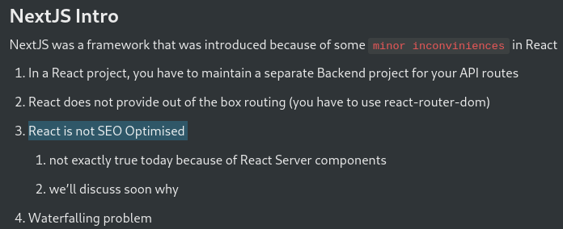
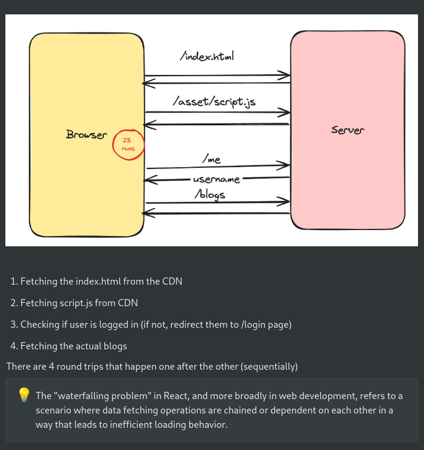
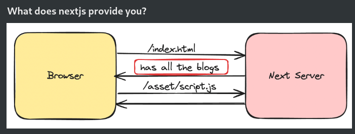

# Next.js Intro

- [Notes](https://projects.100xdevs.com/tracks/nextjs-1/next-1)

### Problems in React 
- Not SEO optimised
- Waterfalling problem

## Waterfall => 
- getting requests(index.html, script.js, and so on) one by one.

- **Solution in Next.JS:**
