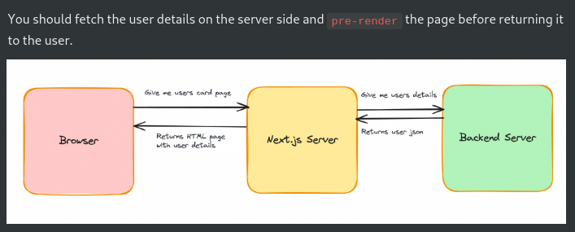

# Server side of Nextjs

## How to do fetch in NEXT =>
- You can do the same thing as the last slide in Next.js, but then you `lose the benefits of server side rendering`
- 

- **NextJS now has concept of  `async component` , which is not there in React.**
- example: 

```js
import axios from "axios";

async function getUserDetails() {
  const response = await axios.get("https://week-13-offline.kirattechnologies.workers.dev/api/v1/user/details")
	return response.data;
}

export default async function Home() {
  const userData = await getUserDetails();

  return (
    <div>
      {userData.email}
      {userData.name}
    </div>
  );
}
```