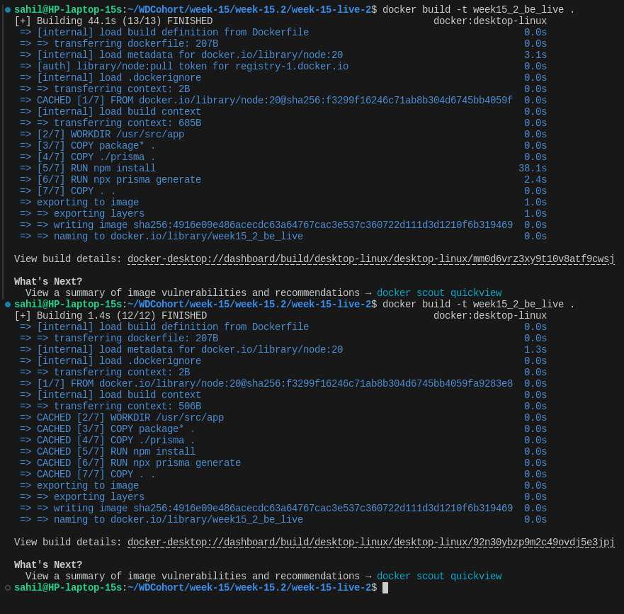

# Layers in Docker -
- [Notes](https://projects.100xdevs.com/tracks/docker-2/docker-2-15)
- In Docker, layers are a fundamental part of the image architecture that allows Docker to be efficient, fast, and portable. A Docker image is essentially built up from a series of layers, each representing a set of differences from the previous layer.
- 
- **The first build takes 314s =>**
- 

- **The next build takes 2.7s, bcoz of Caching. =>**
-  

- We can share layers across images.

- What if `package.json` and `./prisma` rarely changes and `src` does changes.
    - In this case do we really need to copy `package.json` and `./prisma`? Surely No.
    - To make it more optimise, we will divide the `COPY` into parts.
    - 

```Dockerfile
# Optimised Docker file 
FROM node:20

WORKDIR /usr/src/app

COPY package* .
COPY ./prisma .
    
RUN npm install
RUN npx prisma generate

COPY . .

EXPOSE 3000

CMD ["node", "dist/index.js", ]    
```


<hr>

# Networks and volumes
