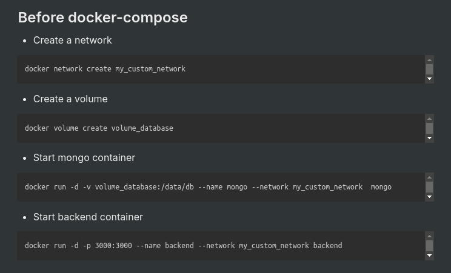

# Docker Compose:
- `docker-compose.yaml`
- `yaml` is similar to `json` format.
- Docker compose is a tool that help you run multi-container Docker applications.
- Docker Compose is a tool designed to help you define and run multi-container Docker applications. With Compose, you use a YAML file to configure your application's services, networks, and volumes. Then, with a single command, you can create and start all the services from your configuration.


- eg: 
```yaml
version: '3.8'
services:
  mongodb:
    image: mongo
    container_name: mongodb
    ports:
      - "27017:27017"
    volumes:
      - mongodb_data:/data/db

  backend22:
    image: backend
    container_name: backend_app
    depends_on:
      - mongodb
    ports:
      - "3000:3000"
    environment:
      MONGO_URL: "mongodb://mongodb:27017"

volumes:
  mongodb_data:


```