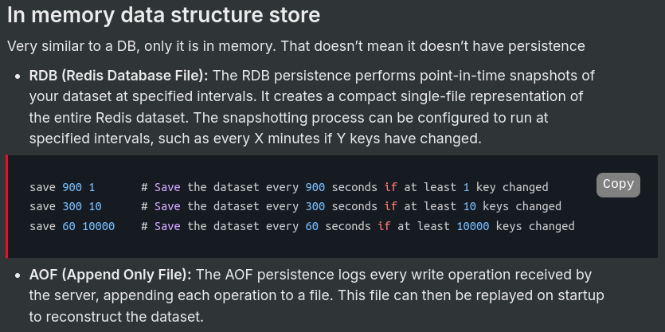

## Pub-sub and Redis - 
https://projects.100xdevs.com/tracks/Redis/Redis1

# Redis:
- Redis is mostly used for caching the data.
- Redis is an open-source, in-memory data structure store, used as a database, `cache`, and message broker.
- One of the key features of Redis is its ability to keep all data `in memory`, which allows for `high performance and low latency access to data.` 

- 