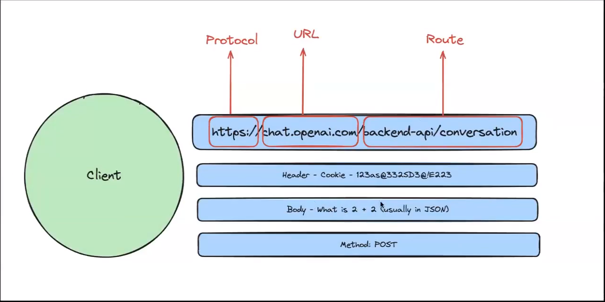
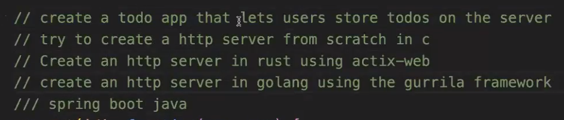

# HTTP Protocol for the Internet


1. **URL** - `https://chat.example.com`
2. **ROUTE** - `https://chat.example.com/ROUTE`
3. **PORT**

## 2.1 Writing a Backend Server

**index.js**

```bash
npm init
npm install express # to install the express library

```
<br>

**To send input to the server from the browser, we can use:**
1. **Query Parameters** - `https://chat.example.com/ROUTE?counter=100` (passing counter=100).<br>
   To send multiple query parameters =>   `https://chat.example.com/ROUTE?counter=100&counter2=49&a=20` (use '&').
   
2. **Headers**
3. **Body**

### Methods - `app.method()`

Four methods are:

1. **GET** - To get data from the backend `app.get('/ROUTE', () => {} )`
2. **POST** - To send or register data to the backend
3. **PUT** - To update data in the backend
4. **DELETE** - To delete data from the backend

### HTTP Methods in Express

1. **GET Method:**
   - Used to retrieve data from the specified resource.
   - In Express: `app.get('/route', (req, res) => { /* handler code */ });`

2. **POST Method:**
   - Used to submit data to be processed to a specified resource.
   - In Express: `app.post('/route', (req, res) => { /* handler code */ });`

3. **PUT Method:**
   - Used to update a resource or create a new resource if it does not exist.
   - In Express: `app.put('/route', (req, res) => { /* handler code */ });`

4. **DELETE Method:**
   - Used to request that a resource be removed or deleted.
   - In Express: `app.delete('/route', (req, res) => { /* handler code */ });`

### Examples:

**GET Example:**
```javascript
app.get('/', (req, res) => {
  res.send('This is a GET request example.');
});
```

**POST Example:**
```javascript
app.post('/submit', (req, res) => {
  const data = req.body; // Assuming you have body-parser middleware to parse the request body.
  // Process and save the submitted data
  res.send('Data submitted successfully.');
});
```

**PUT Example:**
```javascript
app.put('/update', (req, res) => {
  const updatedData = req.body; // Assuming you have body-parser middleware.
  // Update the resource with the provided data
  res.send('Resource updated successfully.');
});
```

**DELETE Example:**
```javascript
app.delete('/delete', (req, res) => {
  // Delete the specified resource
  res.send('Resource deleted successfully.');
});
```

These methods allow you to define routes for different types of actions that can be performed on the server, based on the HTTP methods used in the client's requests.

### Code - (index.js)

```javascript
const express = require('express')
const app = express()
const port = 3000

app.get('/', (req, res) => {
  res.send(`${calculatedSum}`)
})

app.get('/new', (req, res) => {
    let counter = req.query.counter; // getting input from the browser.
    // We can check it here => `http://localhost:3000/new?counter=500`
    res.send(`${sum(counter)}`)
})


// All four Routes =>
app.get('/handleSum', (req, res) =>{
    res.send("Hello handling sum")
})

app.post('/createUser', (req, res) =>{ // cant be handled in Browser hence we use postman
    res.send("CREATE USER")
})

app.listen(port, () => {
  console.log(`Example app listening on port ${port}`)
})

// CREATE Remaining Request

function sum(n){
    let result = 0
    for (let i = 0; i < n; i++) {
        result++;
    }
    return result
}

let calculatedSum = sum(100)


```

## Advanced HW:
