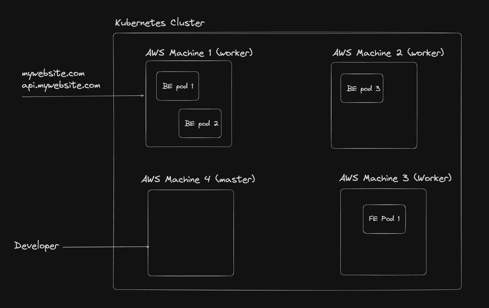

# Kubernetes -1
- [notes](https://projects.100xdevs.com/tracks/kubernetes-1)

- A single `Pod` can run both FE and BE containers.
- `Pod` are inside a Node.
- `Cluster` has `Nodes` has `Pods` has `Containers` runs a `Image`.
- 
