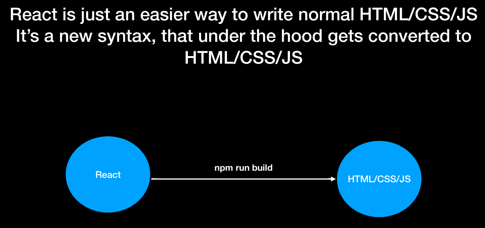
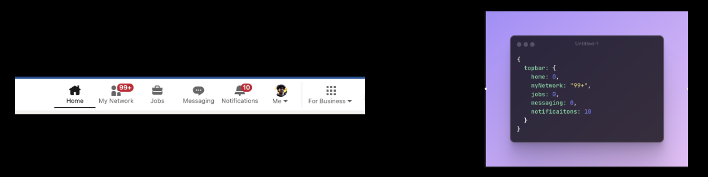
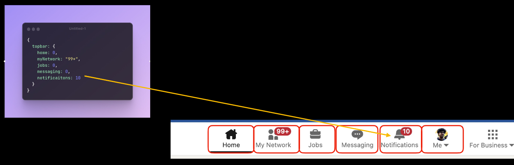
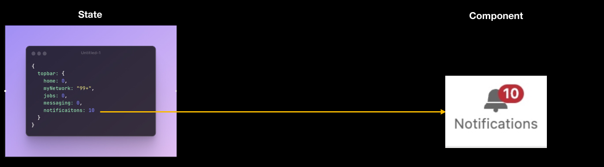
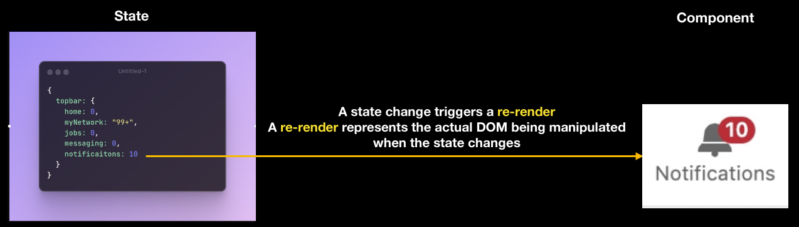

# React

- Its hard to do DOM manipulation
- JQuery was easy way to do DOM
- VueJS/React came later which was more easy

## Some react jargon
To create a react app, we usually need to worry about two things => `State and Component`

- **State**: 
    - Object that represent current state of the app. Represents the dynamic things in your app (things that change).
    - Example: Linkedin Topbar, which has notification which changes with time.

- **Components:** 
    - How a DOM element should render, given a state.
    - It is a re-usable, dynamic, HTML snippet that changes given the state

Componets are in red color

- **Re-rendering:** Changing of component due to state

- You usually have to define all your components once 
- And then all you have to do is update the state of your app, React takes care of re-rendering your app.

## Learing about array destructuring and Object destructuring

### JSX=>
- Its a js file, in which we can write JS and XML 