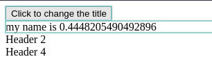
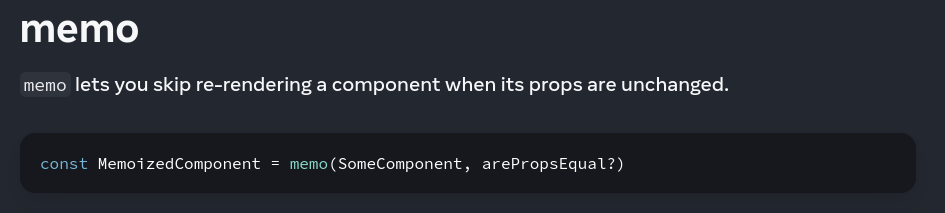
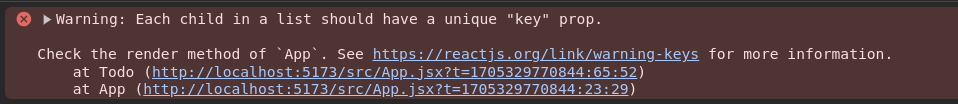

## React component return

### A componet can only return a single top level xml==> because it is easy to do reconcillation.

## Re-rendering in react- 
```js
import { useState } from "react"

function Headers({title}){
  return <div>{title}</div>
}

function App() {
  const [title, setTitle] = useState("My name is title")

  function updateText(){
    setTitle("my name is " + Math.random())
  }
  return (
    <div>
      <button onClick = {updateText} >Click to change the title</button>
      <Headers title={title}></Headers>
      <Headers title={"Header 2"}></Headers>
      <Headers title={"Header 4"}></Headers>
      <Headers title={"Header 3"}></Headers>
      <Headers title={"Header 5"}></Headers>
    <div/>
  )
}

export default App
```

- On clicking btn, the Headers-1 only changes. 
- So according to react only Headers-1 should only re-render. 
- But everything is re-rendering
- A re-render means that:
    1. React did some work to calculate what all should update in this component 
    2. The component actually got called (you can put a log to confirm this) 
    3. The inspector shows you a bounding box around the component

- It happens when 
    1. A state variable that is being used inside a component changes 
    2. A parent component re-render triggers all children re-rendering
    3. Which means... App component is parent component having state title. 
    4. So when title state changes, the component in which state is defined re-renders.

- Solution-1 : Pushing the state down.

```jsx
import { useState } from "react"

function App() {

  return (
    <>
      <HeaderWithBtns></HeaderWithBtns>
      <Headers title={"Header 2"}></Headers>
      <Headers title={"Header 4"}></Headers>
    </>
  )
}

function HeaderWithBtns(){
  const [title, setTitle] = useState("My name is title")
  function updateText(){
    setTitle("my name is " + Math.random())
  }
  return <>
    <button onClick = {updateText} >Click to change the title</button>
      <Headers title={title}></Headers>
  </>
}

function Headers({title}){
  return <div>{title}</div>
}

export default App

```




- Solution - 2 : using memo. See react docs 
    - React Memo: https://react.dev/reference/react/memo


## Key =>

- code without key ==>
```jsx
import { useState } from "react"
import React from "react"

let counter = 4;

function App() {
  const [todos, setTodos] = useState([{
    id: 1,
    title: "Go to gym",
    des: "7-5"
  },
  {
    id:2,
    title: "Go to party",
    des: "6-7"
  }])

  function addTodo(){
    setTodos([...todos, {
      title: "Sleep",
      des: "5 to saw",
      id: counter++
    }])
  }

  return <>
  <button onClick={addTodo}>Add a todo</button>
  {todos.map(function(data){
    return <Todo  title = {data.title} des = {data.des}></Todo> // without key
  })}
  </>
}

function Todo(props){
  return <>
    <h2>{props.title}</h2>
    <h4>{props.des}</h4>
  </>
}
export default App

```
- Error/warning generated ==> 



- https://react.dev/learn/rendering-lists#keeping-list-items-in-order-with-key

- Solution =>

```jsx
...
...
function App() {
    ...
    ...
    return <Todo  key = {data.id} title = {data.title} des = {data.des}></Todo> // Added key
    ...
    ...
}

...
...

```


## Wrapper components

```jsx
import { useState } from "react"
import React from "react"


function App() {
  return <>
    <CardWrapper innerComponent={<TextComponent />}></CardWrapper>
  </>
}

function CardWrapper({innerComponent}){ // can wrap diff compnents
  return <>
  <div style={{
    padding: 2,
    border: "2px solid black"
  }}>
    {innerComponent}
  </div>
  </>
}

function TextComponent(){
  return <>
  <h1>Hello How are you</h1>
  </>
}

export default App

```

- Always use this =>

```jsx
import { useState } from "react"
import React from "react"


function App() {
  return <>
    <CardWrapper>
      hi there // we use this more often. as we can put anything.
      <AnotherComponent />
    </CardWrapper>
  </>
}

function CardWrapper({children}){ // here children has 2 component ==> `hi there` and `<AnotherComponent />`
  return <>
  <div style={{
    padding: 2,
    border: "2px solid black"
  }}>
    {children}
  </div>
  </>
}


export default App

```

## Hooks => 
- functions which starts from use.
- A React hook is a special function that allows you to use state and other React features without writing a class component. 
- Hooks in React are functions that allow you to "hook into" React state and lifecycle features from function components
