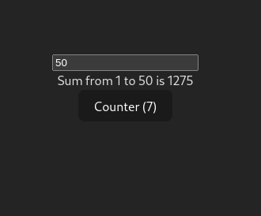

# Common hooks in react

# Side effect:
- Any operation that reaches outside the functional scope of React compoent.
- setTimeout, fetch, setInterval, DOM(document...)

# Hooks:
- (Defination) 
- common hooks are => useState, useEffect, useCallback, useMemo, useRef, useContext

## 1. useState =>
- lets us describe the state of the app.
- When state updates, it triggers a re-render which finally results in DOM update.

## 2. useEffect =>
- allows us to perfom side effects in fuction components.
- Side effects are operations that can affect other components or cant be done during rendering, such as data fetching or manually changing the DOM in React components.
```jsx
useEffect(callbackFunc, [Dependency array]) // callbackFunc can be a fetch()
```
- Dependency array 
    - When should the callback fn run.
    - if empty `[]` then callback calls only one 
    - it takes input: state variable

```jsx
import { useEffect, useState } from 'react'
import './App.css'

function App() {
  const [selectedId, setId] = useState(1)
  return (
    <>
    <button onClick={()=>{
      setId(1);
    }}>1</button>

    <button onClick={()=>{
      setId(2);
    }}>2</button>

    <button onClick={()=>{
      setId(3);
    }}>3</button>

    <button onClick={()=>{
      setId(4);
    }}>4</button>

    <Todo id = {selectedId}></Todo>    
    </>
  )
}

function Todo({id}) {
  const [todo, setTodo] = useState({})

  useEffect( ()=>{
    fetch(`https://sum-server.100xdevs.com/todo?id=${id}`)
    .then(async function(response){
      const json = await response.json()
      setTodo(json.todo)
    })
  }, [id]);

  return <div>
    <h1>
      {todo.title}
    </h1>
    <h4>
      {todo.description}
    </h4>
  </div>
}

export default App

```


## 3. useMemo =>
- Memorization => It means remembering some output given an input and not computing it again.

- Problem:



```jsx
import './App.css'
import { useState } from "react";

function App() {
  const [counter, setCounter] = useState(0);
  const [inputValue, setInputValue] = useState(1);


  let count = 0;
  for (let i = 1; i <= inputValue; i++) { // expensive for loop
    count = count + i;
  }

  return <div>
    <input onChange={function(e) {
      setInputValue(e.target.value);
    }} placeholder={"Find sum from 1 to n"}></input>
    <br />
    Sum from 1 to {inputValue} is {count}
    <br />
    <button onClick={() => {
      setCounter(counter + 1);
    }}>Counter ({counter})</button>
  </div>
}

export default App;


// On clicking the btn it cause re-render of entire App component.
// Which means the expensive for loop runs again, which is not god.
```

- Solution: 

```jsx
import './App.css'
import { useMemo, useState } from "react";

function App() {
  const [counter, setCounter] = useState(0);
  const [inputValue, setInputValue] = useState(1);


  let count = useMemo(() => { // this only runs when inputValue changes
    let finalCount = 0;
    for (let i = 1; i <= inputValue; i++) {
      finalCount = finalCount + i;
    }
    return finalCount;
  }, [inputValue])

  return <div>
    <input onChange={function(e) {
      setInputValue(e.target.value);
    }} placeholder={"Find sum from 1 to n"}></input>
    <br />
    Sum from 1 to {inputValue} is {count}
    <br />
    <button onClick={() => {
      setCounter(counter + 1);
    }}>Counter ({counter})</button>
  </div>
}

export default App;
```

## 4. useCallback =>
- Hook in React used to memoize function.
- (STUDY AGAIN)