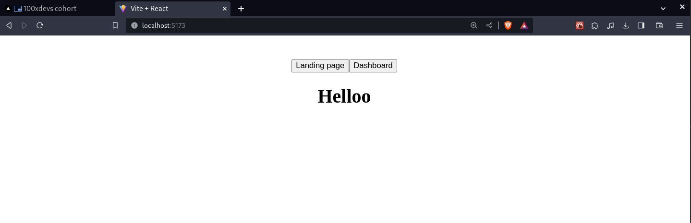
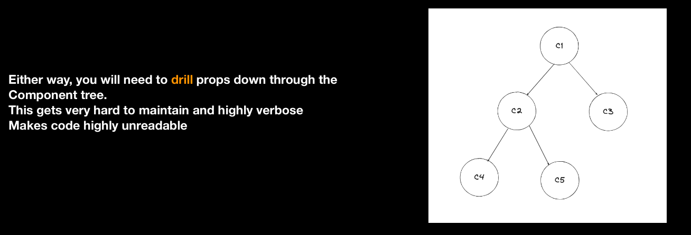
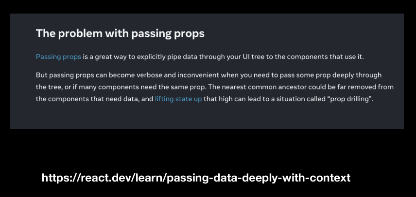
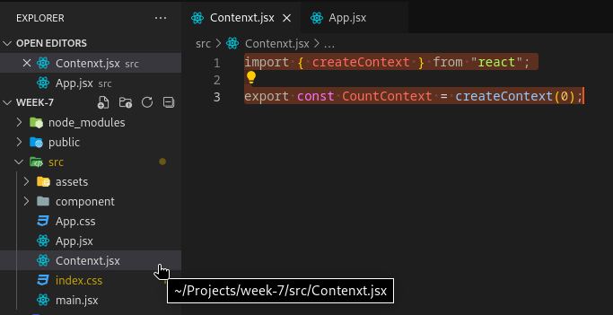
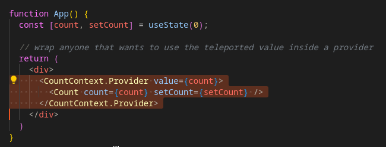
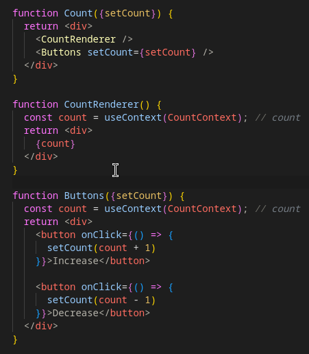

# Routing

- **3 Jargons:**
    - Single page application
    - Client side bundle
    - Client side routing

- `react-router-dom` is a router in dom. (https://reactrouter.com)

```jsx
import { BrowserRouter, Routes, Route } from 'react-router-dom'
import Landing from './component/Landing'
import { Dashboard } from './component/Dashboard'

function App() {
  return (
    <>
    <BrowserRouter>
      <Routes>
        <Route path= "/" element = {<Landing/>}/>
        <Route path= "/dashboard" element = {<Dashboard/>}/>
      </Routes>
    </BrowserRouter>
    </>
  )
}

export default App
```

- header with two btns for routing - 


- Bad way => as it refreshes the page....
    - 
    ```jsx
    function App() {
    return (
        <>
        <div>
        // using window.location
        <button onClick={()=>{
            window.location.href = "/" 
        }}>Landing page</button>

        <button onClick={()=>{
            window.location.href = "/dashboard"
        }}>Dashboard</button>
        </div>
        <BrowserRouter>
        <Routes>
            <Route path= "/" element = {<Landing/>}/>
            <Route path= "/dashboard" element = {<Dashboard/>}/>
        </Routes>
        </BrowserRouter>
        </>
    )
    }
    ```

- Good way => as it doesnt refreshes the page....
    - ```jsx
        import { memo, useState } from 'react'
        import reactLogo from './assets/react.svg'
        import viteLogo from '/vite.svg'
        import './App.css'
        import { BrowserRouter, Routes, Route, useNavigate } from 'react-router-dom'
        import Landing from './component/Landing'
        import { Dashboard } from './component/Dashboard'
        import { Header } from './component/Header'


        function App() {

        // We need to use useNavigate() hooks inside the BrowserRouter's Routes.
        // We cant use it here.

        return (
            <>
        
            <BrowserRouter>
            <Appbar/>
            <Routes>
                <Route path= "/" element = {<Landing/>}/>
                <Route path= "/dashboard" element = {<Dashboard/>}/>
            </Routes>
            </BrowserRouter>
            </>
        )
        }

        function Appbar(){

        const navigate = useNavigate(); // using useNavigate hook
        return  <div>
            <button onClick={()=>{
            navigate('/')
            }}>Landing page</button>

            <button onClick={()=>{
            navigate("/dashboard")
            }}>Dashboard</button>
        </div>
        }

        export default App

        // We need to use useNavigate() hooks inside the BrowserRouter's Routes
    ```

- Lazy Loading: Sending only the code for page 1 only when on page on... and then when we move to page 2 then get the code for it.
- We need to use Suspence API with it=>
    - ```jsx
        import {React, lazy, Suspense }from 'react'
        import './App.css'
        import { BrowserRouter, Routes, Route, useNavigate } from 'react-router-dom'
        // import Landing from './component/Landing'
        // import  Dashboard  from './component/Dashboard'
        import { Header } from './component/Header'

        // LAZY LODING ==>
        const Dashboard = lazy(()=> import('./component/Dashboard'))
        const Landing = lazy(()=> import('./component/Landing'))

        function App() {

        // suspense API, an asyn component fetching, async data fetching
        return (
            <>
            <BrowserRouter>
            <Appbar/>
            <Routes>
                <Route path= "/" element = {<Suspense fallback= {"Loding..."}> <Landing/> </Suspense>}/>
                <Route path= "/dashboard" element = {<Suspense fallback= {"Loding..."}> <Dashboard/> </Suspense>}/>
            </Routes>
            </BrowserRouter>
            </>
        )
        }

        function Appbar(){
        const navigate = useNavigate();
        return  <div>
            <button onClick={()=>{
            navigate('/')
            }}>Landing page</button>

            <button onClick={()=>{
            navigate("/dashboard")
            }}>Dashboard</button>
        </div>
        }
        export default App
        ```

# Prop drilling-
- Push the state down as much as possible

```jsx
import { useState } from 'react'
import './App.css'

function App() {

  const [count, setCount] = useState(0);
  return (
    <>
    <Count count = {count} setCount = {setCount}/>
    </>
  )
}

function Count(props){
  return<>
  <h1>{props.count}</h1>
  <Buttons count = {count} setCount = {setCount}/>
  </>
}

function Buttons(props){
  return<>
  <button onClick={()=>{
    props.setCount(props.count + 1)
  }}>Increment</button>

  <button onClick={()=>{
    props.setCount(props.count - 1)
  }}>Decrement</button>
  </>
}

export default App
```
- Here we can see the `Count` component doesnt really need setCount.
- But it contains `Button` component.
- And the `Button` component needs setCount.
- So the state comes from `App` then `Count` and then `Button`.
- It looks ugly. This is called Prop drilling

- 
- 
- 

# Context API
- ***Context API fixes Prop-Drilling***
- MUST READ - https://react.dev/learn/passing-data-deeply-with-context

## **Steps:**
### 1. Create a `Context.jsx` file inside src. 
```jsx
    import { createContext } from "react";
    export const CountContext = createContext(0);
```

- 
    

### 2. wrap anyone that wants to use the teleported value inside a provider.
- 

### 3. use `useContext` hook inside the required Component



### Code -

```jsx
import { useContext, useState } from "react"
import { CountContext } from "./Contenxt";

function App() {
  const [count, setCount] = useState(0);
  
  // wrap anyone that wants to use the teleported value inside a provider
  return (
    <div>
      <CountContext.Provider value={count}>
        <Count count={count} setCount={setCount} />
      </CountContext.Provider>
    </div>
  )
}

function Count({setCount}) {
  return <div>
    <CountRenderer />
    <Buttons setCount={setCount} />
  </div>
}

function CountRenderer() {
  const count = useContext(CountContext); // count
  return <div>
    {count}
  </div>
}

function Buttons({setCount}) {
  const count = useContext(CountContext); // count
  return <div>
    <button onClick={() => {
      setCount(count + 1)
    }}>Increase</button>

    <button onClick={() => {
      setCount(count - 1)
    }}>Decrease</button>
  </div>
}

export default App
```