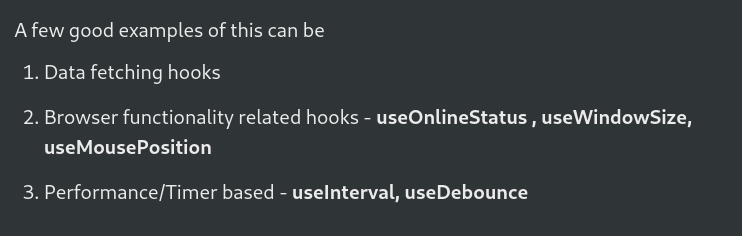

# Custom Hooks =>
- `Daily Code:` **https://daily-code-web.vercel.app/tracks/3Vhp7rCJUVjnvFuPxZSZ/hook-1**

<hr>

**LifeCycle via mount-unmount component:**
```jsx
function MyComponent(){
  
  useEffect(()=>{
    console.log("Mount MyComponent")

    return () => {
      console.log("UnMount MyComponent")
    };

  }, [])
  return <>
      <h2>MyComponent</h2>
    </>
}


function App(){

  const [component, setComponent] = useState(<MyComponent/>)

  useEffect(()=>{
    setTimeout(()=>{
      setComponent(<div/>)
    }, 5000)
  })

  return <>
  <h1>Hi there,</h1>
  {component}
    </>
}
```

<hr>

- `Hooks` that you create yourself, so other people can use them are called custom hooks.
- A custom hook is effectively a function, but with the following properties - 
    - Uses another hook internally (useState, useEffect, another custom hook)
    - Starts with use



## Data fetching hooks =>
- Hooks that we can create to simplify the data fetching logic.
- Ugly way to fetch data =>

```jsx
import './App.css'

import { useEffect, useState } from 'react'
import axios from 'axios'

function App() {
  const [todos, setTodos] = useState([])

  useEffect(() => {
    axios.get("https://sum-server.100xdevs.com/todos")
      .then(res => {
        setTodos(res.data.todos);
      })
  }, [])

  return (
    <>
      {todos.map(todo => <Track todo={todo} />)}
    </>
  )
}

function Track({ todo }) {
  return <div>
    {todo.title}
    <br />
    {todo.description}
  </div>
}

export default App
```