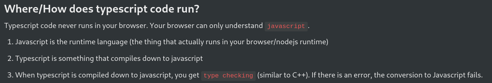
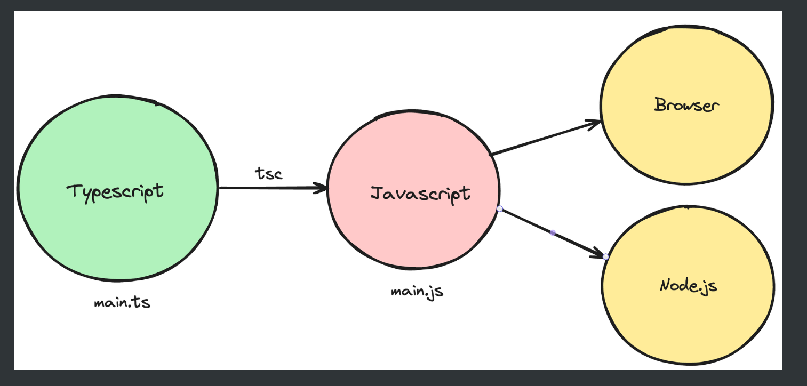

# Typescript =>

**DailyCode:** `https://daily-code-web.vercel.app/tracks/6SbPPXGkG8QKFOTW9BmL/ts-1`

- TypeScript file never runs.
- Typescript file converts to javascript file and then javascript executes.

- `tsc -b` by this we convert .ts file to .js

- We use interface to implement classes.
- type cannot be used to implemnt classes.
- type can used to implement few thing:
    - Union
    - Intersection