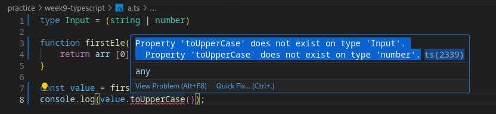

# Enum in TS

- Enums (short for enumerations) in TypeScript are a feature that allows you to define a set of `named constants`
- Enums is a way to create human-readable way to represent a set of constant values.
- For eg. the `doSomething()` function should only accept `up down left right` as input.
- For that we can create a `type`
```ts
type keyInput = "up" | "down" | "left" | "right"

function doSomething(keyPressed:keyInput) {
	// do something.
}

doSomething("up")
doSomething("down")
doSomething("d") // this gives error
```
<hr>

- A cleaner way to do it:

```ts
enum Direction {
    Up,
    Down,
    Left,
    Right
}

function doSomething(keyPressed:Direction) {
	// do something.
    if(keyPressed == Direction.Up){
        // do something.
    }
}

doSomething(Direction.Up)
doSomething(Direction.Down)
```

```js
// Above code in JS=>
"use strict";
var Direction;
(function (Direction) {
    Direction[Direction["Up"] = 0] = "Up";
    Direction[Direction["Down"] = 1] = "Down";
    Direction[Direction["Left"] = 2] = "Left";
    Direction[Direction["Right"] = 3] = "Right";
})(Direction || (Direction = {}));
function doSomething(keyPressed) {
    // do something.
    if (keyPressed == Direction.Up) {
        // do something.
    }
}
doSomething(Direction.Up);
doSomething(Direction.Down);
console.log(Direction.Down);
console.log(Direction.Up);
```

- We can see that the TS code is cleaner than JS.

```ts
// we can give values to enum =>
enum Direction {
    Up = "up", // if I make Up = 1 then Down = 2 OR Up = 100 then Down = 101 and so on...
    Down = "down",
    Left = "left",
    Right = "right"
}
```

- **Common useCase in Express:**
```ts
const app = express()

enum ResponseStatus {
    Success = 200,
    NotFound = 404,
    Error = 500
}

app.get("/', (req, res) => {
    if (!req.query.userId) {
			res.status(ResponseStatus.Error).json({})
    }
    // and so on...
		res.status(ResponseStatus.Success).json({});
})
```

# Generics
- Generics are a `language independent concept` (exist in C++ as well)

```ts
type Input = (string | number)

function firstEle(arr : Input []){
    return arr [0];
}

const value = firstEle(["sahil", 'tiwaskar'])
console.log(value.toUpperCase()); // error
```
- **Error: 1**
- 

- **Error: 2**
- ```ts
    
    type Input = (string | number)

    function firstEle(arr : Input []){
        return arr [0];
    }

    const value = firstEle([1, 2, "sahil", 'tiwaskar']) // we dont want to alllow this
    ```

## Solution => Generics
- Generics enable you to create components that work with any data type while still providing compile-time type safety.
```ts
function identity <T>(args: T) : T{
    return args
}
let op1 = <string>identity("Hello")
let op2 = <number>identity(4)
```
- OR
```ts
function identity <T>(args: T) : T{
    return args
}
let op1 = identity<string>("Hello")
let op2 = identity<number>(4)
```

- Solution for above problem: 
```ts
function getFirstEle <T> (arr: T[]) : T{
    return arr[0];
}
const ele1 = getFirstEle <string> (["sahil", "tiwaskar"])
const ele2 = getFirstEle <number> ([1, 3, 5])
```

# Export and Import Modules =>
- It is like react exports and imports

```ts
export function add(x: number, y: number): number {
    return x + y;
}

export function subtract(x: number, y: number): number {
    return x - y;
}
```

```ts
import { add } from "./math"

add(1, 2)
```

```ts
export default class Calculator {
    add(x: number, y: number): number {
        return x + y;
    }
}
```

```ts
import Calculator from './Calculator';

const calc = new Calculator();
console.log(calc.add(10, 5));
```